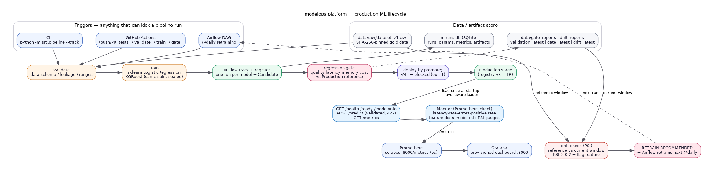

<div align="center">

# ModelOps Platform

**A production ML lifecycle: validation → training → tracking → regression gate → serving → monitoring → drift → retraining.**


</div>

## What it is

Production ML systems don't fail because the code crashes — they fail because bad
data reaches the model, or a "better" model ships even when it regresses quality,
latency, or memory. `modelops-platform` guards every step of the ML lifecycle and
blocks bad deployments automatically.

This project evolves the [Model Regression Detection System](https://github.com/mohammadyakub-ai/model-regression-detection-system)
(a CI/CD-style evaluation harness for LLM features) into a complete, production-style
ML platform.

The full pipeline:

```
Dataset → Validation → Feature Engineering → Training → Experiment Tracking
→ Evaluation → Regression Gate → Model Registry → Deployment → Monitoring
→ Drift Detection → Retraining
```

## Live demo

Two public surfaces — one interactive, one static:

| URL | What it is |
|---|---|
| `https://modelops-serving.onrender.com/demo` | **Live serving demo** — real model, real `/predict`, real Prometheus metrics rendered as a live dashboard (built from `render.yaml`, blueprints section below) |
| `https://mohammadyakub-ai.github.io/modelops-platform/` | **Static site** — architecture, measured benchmarks, drift results, deploy steps (built by the `pages` workflow on every main push) |

> Render free instances sleep after ~15 min idle; the first request after sleep
> triggers a cold start (~30–60 s). The `/demo` page polls every 3 s, so keep a
> tab open for uninterrupted streaming.

## Phase status

| Phase | Module | Status |
|-------|--------|--------|
| 1 | Data validation + Training pipeline | ✅ done |
| 2 | Experiment tracking + Model registry (MLflow) | ✅ done |
| 3 | Regression gate | ✅ done |
| 4 | Serving + Docker + CI/CD | ✅ done |
| 5 | Monitoring + drift detection | ✅ done |
| 6 | Polish + benchmarks + demo | ✅ done (this phase) |
| 7 | Production stack: PostgreSQL + S3/MinIO + real CI + GHCR + live site | ✅ done |

Live recap and interview-prep notes: **[PROJECT_RECAP.md](PROJECT_RECAP.md)**
Full technical docs + all run/restart commands: **[docs/PROJECT.md](docs/PROJECT.md)**

## Quick start

```bash
python -m venv .venv && source .venv/bin/activate
pip install -r requirements.txt

# The dev machine sources ROS which pollutes PYTHONPATH — run like this:
PYTHONPATH= python -m src.pipeline                       # validate + train
PYTHONPATH= python -m src.pipeline --track               # + MLflow, registry, gate, deploy
PYTHONPATH= python -m pytest tests/ -q                   # run tests (38)

# Serving (needs a Production model in the registry — see --track above):
PYTHONPATH= MLFLOW_DISABLE_AGENT_HINT=1 .venv/bin/uvicorn src.serving.api:app --port 8000
```

#### MLflow UI — production stack (PostgreSQL + MinIO/S3)

`scripts/devstack.sh` brings up the production-grade tracking stack with one
command — real **PostgreSQL** backend store and a **MinIO** (S3-compatible)
artifact store, so model binaries live in S3-style buckets, not the local FS:

```bash
scripts/devstack.sh up                 # postgres :5432, minio :9000/:9001, mlflow :5000
eval "$(scripts/devstack.sh env)"      # export MLFLOW_TRACKING_URI + AWS_* vars
MLFLOW_TRACKING_URI="$MLFLOW_TRACKING_URI" PYTHONPATH= python -m src.pipeline --track
```

- Tracking UI → http://localhost:5000 (registry + runs backed by PostgreSQL).
- Artifacts → `s3://mlflow-artifacts/` on MinIO (console http://localhost:9001, `minioadmin`/`minioadmin`).
- **Swap to real AWS S3 with two vars:** set `MLFLOW_S3_ENDPOINT_URL` to the
  AWS endpoint in `env/prod.env` and export real `AWS_ACCESS_KEY_ID` /
  `AWS_SECRET_ACCESS_KEY` (the `~/.aws` default profile also works) — no code change.
- Plain-sqlite quick start is unchanged (`mlflow server --backend-store-uri sqlite:///mlruns.db ...`).

Status: `scripts/devstack.sh status`.

> Note: this machine has the Docker CLI but no `dockerd` daemon, so the container
> path is validated (`docker compose config` OK) and runs as-is on a Docker-enabled host.

Known environment quirk: if `source /opt/ros/humble/setup.bash` ran in your shell,
unset `PYTHONPATH` for pip/python commands, otherwise pytest loads ROS plugins and
fails with `ModuleNotFoundError: No module named 'lark'`.

## Architecture



Three planes, one loop:

- **Batch pipeline** (top): any trigger — GitHub Actions (`ci.yml`), the CLI
  (`python -m src.pipeline --track`), or the Airflow DAG — runs the same steps:
  validate → train (sklearn LR + XGBoost on a sealed split) → MLflow track/
  register → best-by-ROC-AUC staged as **Candidate** → regression gate vs the
  **Production** reference. PASS promotes Candidate → Staging → Production; FAIL
  exits 1 and leaves production untouched.
- **Serving runtime** (middle): FastAPI loads the Production model once at
  startup and exposes `/predict` (validated, 422), `/health`, `/ready`,
  `/model/info`, and `/metrics` (Prometheus).
- **Observability** (bottom): Prometheus scrapes `/metrics`; Grafana renders the
  provisioned dashboard; the drift check computes per-feature PSI vs the gold
  window and can raise a retraining alert that the scheduler acts on next run —
  closing the loop back to training.

Source of truth for the diagram: [`docs/architecture.dot`](docs/architecture.dot).

## What Phase 1 delivers

### Data (versioned artifact)

`data/raw/dataset_v1.csv` — 1,200 loan-risk rows, 9 columns, balanced 600/600,
generated deterministically by `scripts/generate_sample_data.py` (seed 42).
The CSV — not the generator — is the gold artifact; it is SHA-256 hashed and the
hash travels with every trained model as lineage.

> The source project's dataset was an LLM golden-set (JSON), not tabular, so it is
> referenced as lineage rather than reused for sklearn/XGBoost training.

### Validation — `src/validation/validator.py`

Config-driven checks, fail fast (raise `ValidationError` with a partial report):

1. file exists
2. schema — required columns present (features + target)
3. row count ≥ `min_rows`
4. missing-value ratio ≤ `max_missing_pct` per column
5. value ranges per `column_ranges` in config
6. leakage — the target column must not be a feature
7. id column uniqueness

Every run writes `data/validation_reports/validation_latest.json` (typed with Pydantic).

### Training — `src/training/trainer.py`

- reads everything from `configs/train_config.yaml`
- seeds `random`, `numpy`, `torch` so the same config + data = same result
- stratified 80/20 split (seed 42)
- trains an sklearn `LogisticRegression` baseline **and** an `XGBClassifier`
- saves `artifacts/models/<model>_v1.joblib` + metadata JSON:
  params, metrics, data SHA-256, seed, training duration, feature list

### Measured results (Phase 1, seed 42, 960 train / 240 test)

| Model | Accuracy | F1 | ROC-AUC | Train time |
|---|---|---|---|---|
| LogisticRegression | 0.7792 | 0.7854 | 0.8649 | 0.06 s |
| XGBoost (100 est, depth 3) | 0.7708 | 0.7679 | 0.8466 | 14.7 s |

- Data file SHA-256: `ffc1f77291204e3aa4e5a2f39e97127c62b351612477ac4d15b6b21cf8822b3c`
- Tests: **15 passed** (~60 s) — validator/trainer Phase 1 + tracking/registry Phase 2

## What Phase 2 delivers

### Experiment tracking — `src/tracking/tracker.py`

`MLflowTracker` owns the run lifecycle (FINISHED / FAILED), logging for every model:

- params — model hyperparameters, split test size/seed, feature count
- metrics — accuracy, F1, ROC-AUC, training duration (all measured at train time)
- lineage — source data file + its SHA-256
- the model artifact itself (`mlflow.sklearn` / `mlflow.xgboost` flavor)

Design detail: **one MLflow run per model**. A single run holding both models made
the registry show xgboost's numbers on the logistic-regression version (the same
metric keys collided). Per-model runs keep every registered version's metrics honest.

### Model registry — `src/registry/registry.py`

`ModelRegistry` provides the lifecycle stages the guide defines —
`candidate -> staging -> production` — plus rollback:

- `register` — new version from a tracked run's model_uri
- `list_versions` — every version with current stage + its run's real metrics
- `promote` — validate + transition to a stage
- `rollback` — demote the current holder, promote the newest older version

**Design decision:** MLflow has no native `Candidate` stage (only `None` /
`Staging` / `Production` / `Archived`). `Candidate` is implemented as a version tag
(`modelops_stage=candidate`) that the registry translates on read/write. Good
interview point: "stages are being deprecated in MLflow; the platform maps its own
stage vocabulary onto tags so nothing is hard-wired to a vendor quirk."

The pipeline stages the best **measured** model (highest ROC-AUC) as `Candidate`,
never `Production` — Production is decided by the regression gate in Phase 3.

### Measured Phase 2 registry state (fresh run, seed 42)

| Registered model | Version | Stage | Accuracy | F1 | ROC-AUC |
|---|---|---|---|---|---|
| modelops_logistic_regression | 1 | Candidate | 0.7792 | 0.7854 | 0.8649 |
| modelops_xgboost | 1 | None | 0.7708 | 0.7679 | 0.8466 |

MLflow UI (verified via `GET /health` → 200 and the registered-models API)
shows these runs, versions and metrics.

## What Phase 3 delivers

### Regression gate — `src/gate/regression_gate.py` (the differentiator)

The gate answers one question before any deploy: **is this candidate provably no
worse than what's in production, on every dimension that matters?**

- **Quality** — accuracy / F1 / ROC-AUC deltas vs the production reference
  (min delta `-0.01` each)
- **Latency** — measured p95 must stay under 200 ms (absolute)
- **Memory** — measured resident footprint under 512 MB (absolute)
- **Cost** — estimated $/1M predictions may exceed reference by ≤ 10%

Latency/memory/cost are **measured** at gate time on the same hardware for both
models; nothing is estimated except the explicit price model (`cpu_hour_usd`).

```console
[gate] candidate=logistic_regression v1 vs production reference=none (bootstrap)
[gate] verdicts: quality=SKIP latency=PASS memory=PASS cost=SKIP -> PASS
[gate] PASS — deployed logistic_regression v1 to Production
```

The side-by-side report lands in `data/gate_reports/gate_latest.json` and as an
MLflow artifact. On FAIL the pipeline exits 1 and **production is untouched** —
verified end-to-end by tightening the latency cap below the candidate's real
p95 (1.11 ms): `latency=FAIL cost=FAIL` → blocked, `Production` stayed v1.

### Pipeline → deploy contract

```
validate ─► train ─► track ─► register ─► stage best as Candidate
                                            └─► gate:  PASS ─► Staging ─► Production
                                                        FAIL ─► blocked (exit 1)
```

Bootstrap: with no production reference the gate SKIPs quality/cost but still
enforces the absolute latency/memory caps, so the first deploy is safe-by-default.

### Tests

- `tests/test_validator.py` — passes on project data; rejects leakage, missing
  column, out-of-range values, too-few rows, excessive missing values
- `tests/test_trainer.py` — artifacts + metadata written with data hash;
  same-seed runs produce identical metrics (reproducibility); data hash tracked
- `tests/test_tracking_registry.py` — tracker records a FINISHED run with
  metrics/params; register→promote→list; candidate-via-tag; rollback;
  training logs one run per model with clean per-model metrics
- `tests/test_regression_gate.py` — PASS on all thresholds; FAIL on quality
  regression, p95 over cap, memory over cap, cost over pct; bootstrap passes
  without reference but still enforces absolute caps

  **23 tests passing** (~45 s)

## What Phase 4 delivers

### Serving — `src/serving/api.py` (FastAPI, serves the Production model)

| Endpoint | Contract |
|---|---|
| `GET /` | redirects to `/demo` |
| `GET /demo` | live dashboard page — polls `/metrics` + `/model/info` every 3 s |
| `GET /health` | liveness — process alive |
| `GET /ready` | readiness — model loaded (503 until it is) |
| `GET /model/info` | Production model: name, version, run metrics, real served p95/p99 |
| `POST /predict` | validated inference → `{prediction, probability}`; 422 on bad input, 503 when no model |

```bash
curl -s -X POST localhost:8000/predict -H 'Content-Type: application/json' -d \
  '{"age":45,"income":72000,"credit_score":680,"loan_amount":24000,"employment_years":8,"num_defaults":1,"has_collateral":1}'
# {"prediction": 0, "probability": 0.167547}
```

- feature bounds are **config-driven** (`serving.feature_bounds`) → structured Pydantic 422s
- model resolved once at startup from the registry `Production` stage (flavor loader keeps `predict_proba`)
- latency middleware → `/model/info` reports the API's **own** measured latency

**Measured over real HTTP (LR prod model, 200 requests):** p50 **2.96 ms** ·
p95 **4.42 ms** · p99 **4.87 ms** (full round-trip); middleware-internal p95 **1.49 ms**.

### Docker — `docker/serving.Dockerfile` (multi-stage)

Deps install into a clean prefix → slim runtime copies prefix + app (cacheable layers).
`serving` service added to compose with a `/ready` healthcheck; Airflow runs under
a profile: `docker compose --profile airflow up airflow` (one-node, :8080).
(`docker compose config` validated; images build on a Docker-enabled host/CI — no daemon here.)

### CI/CD — `.github/workflows/ci.yml`

On push to `main` (and every PR): **tests → Postgres + MinIO service containers →
validation → training → regression gate on the real prod backend → snapshot bake →
GHCR image push → live-container smoke test**. Only a **gated** main run ships the
image (`ghcr.io/mohammadyakub-ai/modelops-platform:latest` + SHA) — the classic
ML CI problem: "training is the build step". The smoke test exercises the **built
container** start-to-ready and a real `/predict` before "success" is reported.
Gate report uploaded as PR evidence.

`.github/workflows/retrain.yml` runs a scheduled **drift check → gated retrain**
(a `17 2 * * *` cron + manual dispatch) when a feature's PSI flags the alert.

### Render blueprints — `render.yaml`

One-click live deployment: New → Blueprint → this repo creates a `modelops-serving`
web service from `docker/serving.Dockerfile`. The image is **self-contained** —
the certified model snapshot baked by CI is registered at container start — so the
free tier needs no external Postgres/S3. See `render.yaml` header comments.

### Airflow — `pipelines/airflow/modelops_pipeline_dag.py`

A `@daily` retraining DAG that calls the **same step functions** the CLI runs
(`step_validate` → `step_train_track` → `step_gate_deploy`). A FAIL verdict makes the
DAG red and production stays untouched — orchestration status doubles as the deploy signal.

### Pipeline refactor

`src/pipeline.py` now exposes three coarse steps shared by CLI, CI and the DAG
(single source of truth). Day-2 deploy path proven: second `--track` run gated
candidate v3 vs production v1 → **quality/latency/memory/cost all PASS** → promoted.

### Tests

7 serving tests (health, ready, predict happy path, 422 missing/out-of-range,
model-info latency stats, 503 when no production model).
**30 tests passing** (~70 s).

## What Phase 5 delivers

### Serving metrics — Prometheus at `GET /metrics`

The `serving` app exports live metrics from the same process that serves
predictions (no separate agent to drift out of sync):

| Metric | Kind | What it tracks |
|---|---|---|
| `modelops_prediction_latency_seconds` | Histogram | per-request inference latency on the API path |
| `modelops_predictions_total` | Counter | predictions, labelled `prediction` + `model_version` |
| `modelops_prediction_errors_total` | Counter | failed predictions by error class |
| `modelops_positive_rate` | Gauge | mean predicted probability — a concept-drift canary |
| `modelops_feature_value_seconds` | Histogram | per-feature input distributions |
| `modelops_model` | Info | served model name + version |
| `modelops_feature_psi` / `modelops_drift_alert` | Gauge | latest drift report mirrored into Prometheus |

```bash
curl -s localhost:8000/metrics | grep modelops_
modelops_predictions_total{model_version="modelops_logistic_regression@3",prediction="0"} 25.0
modelops_feature_psi{feature="income"} 0.6356
modelops_drift_alert 1.0
modelops_model_info{name="modelops_logistic_regression",version="3"} 1.0
```

### Drift detection — PSI per feature

`src/monitoring/drift.py` computes the Population Stability Index of each feature
between the reference window (`data/raw/dataset_v1.csv`) and a current window.
PSI > 0.2 flags a feature → `data/drift_reports/drift_latest.json` + an MLflow
`drift_check` run + **RETRAIN RECOMMENDED** verdict.

```bash
PYTHONPATH= MLFLOW_DISABLE_AGENT_HINT=1 python -m src.monitoring   # run the drift check
```

Measured against real gold data (1200 rows × 7 features):
- `current_same.csv` (no drift): all features **PSI 0.0000**
- `current_shifted.csv` (income ×1.5): **only income PSI 0.636** → `flagged=['income']`

### Grafana — one dashboard, pre-provisioned

`dashboards/` ships a Prometheus scrape config and Grafana provisioning (datasource
+ dashboard auto-loaded on first start). Panels: request rate by class, latency
p95 (from the histogram), error rate, positive rate, a **per-feature PSI bar
gauge with the 0.2 threshold warning band**, a drift alert stat, and the served
model stat. Bring it up with Docker:

```bash
docker compose up -d serving prometheus grafana   # Grafana :3000 (anonymous admin)
```

(`docker compose config` validated here; containers need a Docker-enabled host.)

### Tests

8 new monitoring tests — PSI identity ≈ 0; shifted > threshold; only the shifted
feature flags; report persistence + alert; constant feature never false-alarms;
Monitor records; `/metrics` export; drift-gauge sync. **38 tests passing** (~75 s).

## Benchmarks (measured, not estimated)

`scripts/benchmark.py` is the reproducible harness (all numbers below from a run
against the live uvicorn server, full HTTP round-trip).

**Serving (Production LR, seed-42 data, 2 000 requests)** — host: localhost,
16 cores, 15 GiB, Python 3.10:

| Metric | Value |
|---|---|
| Latency avg | **3.09 ms** |
| Latency p50 / p95 / p99 | **3.02 / 4.22 / 4.77 ms** |
| Throughput, sequential | **324 req/s** |
| Throughput, 8 concurrent | **578 req/s** |
| Serving process RSS / peak | **~290 MB / ~290 MB** |

Raw artifact: [`data/benchmarks/serving_benchmark.json`](data/benchmarks/serving_benchmark.json).

**Model quality (same sealed split, 960/240):** LR accuracy **0.7792** · f1
**0.7854** · ROC-AUC **0.8649**; XGBoost ROC-AUC **0.8466**. The gate therefore
stages LR — the model with the *better measured* AUC — and that is what serves
in Production (see `gate_latest.json`).

**Gate contract (from config + the day-2 run):** candidate vs production reference
must be within `min_delta=-0.01` ROC-AUC, `p95 ≤ 200 ms`, `memory ≤ 512 MB`,
`cost_delta ≤ 10%`; bootstrap SKIPs quality/cost but still enforces the absolute
caps.

## 3-minute demo

One command runs the whole loop — validate → train+track → gate+deploy → serve →
drift alert — printing live numbers at every step:

```bash
PYTHONPATH= MLFLOW_DISABLE_AGENT_HINT=1 python scripts/demo.py
```

Demo run (this repo, seed-42 data): validate PASSED · LR auc=0.8649 vs XGB
0.8466 → LR staged Candidate · gate verdicts **quality/latency/memory/cost all
PASS** → deployed to Production · `/predict` returns `{"prediction": 0,
"probability": 0.167547}` · drift check flags **income PSI 0.636 →
RETRAIN ALERT**. Total **~15 s**.

## Repository layout

```text
.
├── configs/train_config.yaml      # all pipeline knobs (+ serving bounds, gate)
├── data/raw/dataset_v1.csv        # versioned gold data
├── scripts/generate_sample_data.py
├── scripts/simulate_drift.py         # drift windows (same / income·1.5)
├── scripts/benchmark.py              # reproducible serving benchmark (JSON out)
├── scripts/demo.py                   # 3-min lifecycle demo, one command
├── src/
│   ├── config.py                  # config loading / typed config assembly
│   ├── pipeline.py                # step_validate / train_track / gate_deploy
│   ├── validation/validator.py
│   ├── training/trainer.py
│   ├── tracking/tracker.py        # MLflowTracker
│   ├── registry/registry.py       # ModelRegistry (candidate/staging/production)
│   ├── gate/regression_gate.py    # deploy gate
│   ├── serving/api.py             # FastAPI inference service + /metrics
│   └── monitoring/                # monitor.py (Prometheus) + drift.py (PSI)
├── pipelines/airflow/             # retraining DAG (same step functions)
├── dashboards/                    # prometheus.yml + grafana provisioning/dashboard
├── .github/workflows/ci.yml       # tests -> gate -> image (Postgres + MinIO services)
├── .github/workflows/retrain.yml  # scheduled drift-check -> retrain cron
├── .github/workflows/pages.yml    # builds the static live site to GitHub Pages
├── docker/                        # mlflow + serving images
├── docker-compose.yml             # postgres + minio + mlflow + serving + prometheus + grafana (+airflow profile)
├── env/prod.env                   # prod stack env (Postgres + MinIO/S3 endpoints)
├── scripts/devstack.sh            # one-command prod tracking stack (up/env/status)
├── scripts/bake_model.py          # snapshot certified model + manifest into deploy/
├── scripts/bootstrap_registry.py  # container-start registry hydration
├── deploy/model/                  # committed production snapshot (ships in the image)
├── render.yaml                    # Render blueprint → live serving service
├── site/                          # static site source (pages workflow deploys it)
├── docs/architecture.dot|png      # editable + rendered architecture diagram
├── tests/                         # 38 tests
├── PROJECT_RECAP.md               # week-by-week study recap + interview prep
└── requirements.txt
```

Planned (Phase 6): architecture diagram, published benchmarks, demo script, final README.
Remaining skeleton modules (`retraining/`) will be commanded by the drift alert.

## Design decisions (Phase 1)

| Decision | Rationale |
|---|---|
| Committed CSV as the gold artifact | Data is versioned like code; the hash is lineage |
| Deterministic synthetic data | Known true distributions → honest metrics + reliable drift tests in Phase 5 |
| Config-driven thresholds | Deployment/validation policy lives in YAML, never hard-coded |
| sklearn baseline + XGBoost | Baseline vs powerful model on the same split — an honest comparison story |
| Reject-on-validation-failure | The pipeline refuses to train on bad data instead of "warning" |
| Pydantic for config/report | Typed contracts so CI can consume the JSON report safely |
| SQL store for MLflow | SQLite for dev, PostgreSQL for prod — SQL skills proven in the registry layer |
| One MLflow run per model | Registered versions must carry their own, non-colliding metrics |
| Candidate as a tag, not a stage | MLflow has no native Candidate; platform vocabulary maps onto tags cleanly |
| Best-by-ROC-AUC → Candidate | Promotion is data-driven and measured, never hard-coded |
| Measured deltas for deploy | Gate compares same-split, same-harness measurements — the prerequisite for a real regression call |
| Flavor-aware serving load | Loading via sklearn/xgboost flavor keeps `predict_proba` in the service, not just classes |
| Liveness vs readiness | `/ready` gates traffic on "model loaded", enabling later zero-downtime rollouts |

## Limitations (honest)

- Synthetic data: fine for teaching lifecycle skills, not for real lending
- **Live stack runs locally and in CI** (devstack.sh: PostgreSQL + MinIO/S3 +
  MLflow; CI runs the same backend in service containers). On this box the
  `docker compose` stack itself can't be launched — no `dockerd` — but the
  **real serving image is built and smoke-tested on every CI run** (GHCR) and is
  what Render deploys.
- Single-instance serving by design for the study; scale-out story is documented
  (readiness-gated traffic + PostgreSQL + S3 artifacts, both live in this stack)
- **Artifact-store lesson (self-caught during Phase 6):** a local `sqlite:///mlruns.db`
  run keeps model binaries under `./mlruns/` and the DB only metadata; a careless
  `rm -rf mlruns` lost every version's artifacts (metadata survived). Recovery =
  retrain + re-register + re-promote (`docs/PROJECT.md`). That is exactly why the
  production path here uses **PostgreSQL + MinIO/S3** — artifacts survive the app host.
- MLflow model-registry **stages are deprecated** (mlflow ≥ 2.9); the project
  stays honest about this: `Candidate` is already tag-based, and Staging/Production map
  cleanly to aliases when migrating.

## License

MIT — see [LICENSE](LICENSE).